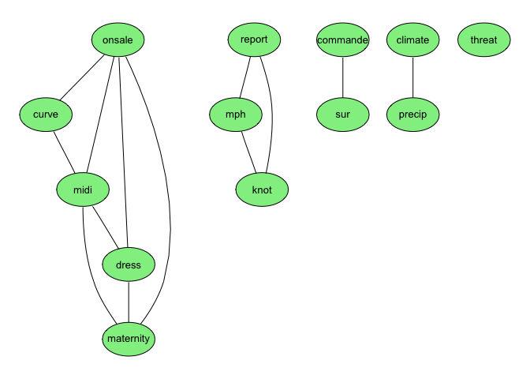
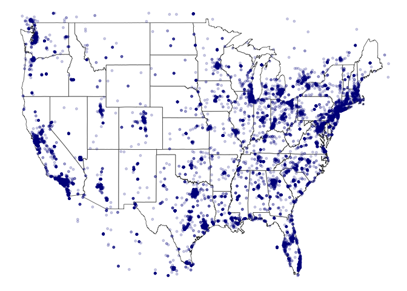

Web Scrapping and Text Mining on Social Media Data in Fashion Industry
================

Background and Problem Statement
--------------------------------

Today, our generation lives in a time where tv shows are being streamed on Netflix and news is breaking online. With the rapid development of computer science and information technology, social media have become prominent parts of life for many people. Through social media, people can connect with each other, share their opinions, and access information they need easily and immediately. Social media has also changed the fashion industry, as well as every other industry completely. It gives companies the ability to directly reach their consumers and enables customers to share their opinions and reviews on fashion brands and trends.

In this project, I will web scrape data in fashion industry from Twitter and make it ready for analysis through data cleaning and data management process. Text mining will be conducted to analyze tweets discussion of clothing and fashion, and provide us insights on people’s opinions on fashion brands and trends.

About the Data
--------------

The data in this project was collected from tweets regarding fashion brands and clothing. To analyze people's opinions on fashion brands and trends, Twitter Search API was used to collect recent past tweets regarding the top 15 clothing brands for late twenties and early thirties, including the following: ASOS, Ann Taylor, ModCloth, J.Crew, UNIQLO, Madewell, Forever 21, COS, Rag & Bone, Tory Burch, Rebecca Minkoff, Kate Spade, Michael Kors, Calvin Klein, and Club Monaco. In addition, real-time tweets regarding fashion and clothing was also collected by using Twitter Streaming API for the purpose of exploratory analysis.

Create an Application
---------------------

To collect data from Twitter, we'll first need to set up an application at <https://apps.twitter.com>. This will allow us to connect R to the Twitter stream. You’ll need a name, description, and website. I’ve used my Github address as a website, though I’d imagine that anything works. Once created, click on "modify app permissions" and allow the application to read, write and access direct messages. Lastly, click on the API Keys tab and scroll to the bottom of the page. Under token actions, click on "Create my access token". Four API credentials will be created, including API Key, API Secret, Access Token, and Access Token Secret. We’ll need these access tokens when we fire up R.

Collect Past Tweets using Search API
------------------------------------

To use the Twitter Search API, Streaming API and conduct data analysis and text mining, we need the following packages.

``` r
library(twitteR)
library(streamR)
library(RCurl)
library(RJSONIO)
library(stringr)
library(ROAuth)
library(tm)
library(SnowballC)
library(textstem)
library(plyr)
library(dplyr)
library(ggplot2)
library(wordcloud)
library(grid)
```

Once these packages are installed and loaded, we can set up our connection to the Twitter Search API and collect recent posted tweets regarding the top 15 clothing brands for late twenties and early thirties. A function called `getTweets` was created to get tweets in data.frame format. In addition, the `ldply` function in package **plyr** was used to get tweets for all brands in parallel.

``` r
api_key <- "2mFZzH2upCzXpBaCIj5WPzzrE"
api_secret <- "wUVlH9McGi6abhBte1KENwFYlp8GM4yxdyCWUwzNsNVCAboMBK"
access_token <- "874754472072716288-Eh56bVcOat9ezRBhUppNmpX2gLaFTHD"
access_token_secret <- "crtjWOQHs2tRllzdM0AWVObRiryHf8TjWfQH3gmqyNR6B"
setup_twitter_oauth(api_key, api_secret, access_token, access_token_secret)
```

    ## [1] "Using direct authentication"

``` r
#Collect Tweets
brands <- list("ASOS", "AnnTaylor", "ModCloth", "jcrew", "Uniqlo", "madewell", "Forever21", "cosstores", "rag_bone", "toryburch", "RebeccaMinkoff", "katespadeny", "MichaelKors", "CalvinKlein", "ClubMonaco")
getTweets <- function(brand, n = 10000) {
  search_string <- paste0("@", brand, " OR ", "#", brand, " OR ", brand)
  # get tweets
  tweets <- searchTwitter(search_string, since = "2017-05-01", n = n)
  # strip retweets
  tweets <- strip_retweets(tweets, strip_manual = TRUE, strip_mt = TRUE)
  # convert to data.frame
  tweetdf <- twListToDF(tweets)
  # add brand and return
  out <- cbind(brand, tweetdf)
  return(out)
}
tweets_by_brand <- ldply(brands, function(brand) getTweets(brand, n = 10000))
```

    ## Warning in doRppAPICall("search/tweets", n, params = params,
    ## retryOnRateLimit = retryOnRateLimit, : 10000 tweets were requested but the
    ## API can only return 520

    ## Warning in doRppAPICall("search/tweets", n, params = params,
    ## retryOnRateLimit = retryOnRateLimit, : 10000 tweets were requested but the
    ## API can only return 1293

    ## Warning in doRppAPICall("search/tweets", n, params = params,
    ## retryOnRateLimit = retryOnRateLimit, : 10000 tweets were requested but the
    ## API can only return 2607

    ## [1] "Rate limited .... blocking for a minute and retrying up to 119 times ..."
    ## [1] "Rate limited .... blocking for a minute and retrying up to 118 times ..."
    ## [1] "Rate limited .... blocking for a minute and retrying up to 117 times ..."
    ## [1] "Rate limited .... blocking for a minute and retrying up to 116 times ..."
    ## [1] "Rate limited .... blocking for a minute and retrying up to 115 times ..."
    ## [1] "Rate limited .... blocking for a minute and retrying up to 114 times ..."
    ## [1] "Rate limited .... blocking for a minute and retrying up to 113 times ..."
    ## [1] "Rate limited .... blocking for a minute and retrying up to 112 times ..."
    ## [1] "Rate limited .... blocking for a minute and retrying up to 111 times ..."
    ## [1] "Rate limited .... blocking for a minute and retrying up to 110 times ..."
    ## [1] "Rate limited .... blocking for a minute and retrying up to 109 times ..."

    ## Warning in doRppAPICall("search/tweets", n, params = params,
    ## retryOnRateLimit = retryOnRateLimit, : 10000 tweets were requested but the
    ## API can only return 1727

    ## [1] "Rate limited .... blocking for a minute and retrying up to 119 times ..."
    ## [1] "Rate limited .... blocking for a minute and retrying up to 118 times ..."
    ## [1] "Rate limited .... blocking for a minute and retrying up to 117 times ..."
    ## [1] "Rate limited .... blocking for a minute and retrying up to 116 times ..."
    ## [1] "Rate limited .... blocking for a minute and retrying up to 115 times ..."
    ## [1] "Rate limited .... blocking for a minute and retrying up to 114 times ..."
    ## [1] "Rate limited .... blocking for a minute and retrying up to 113 times ..."
    ## [1] "Rate limited .... blocking for a minute and retrying up to 112 times ..."
    ## [1] "Rate limited .... blocking for a minute and retrying up to 111 times ..."
    ## [1] "Rate limited .... blocking for a minute and retrying up to 110 times ..."
    ## [1] "Rate limited .... blocking for a minute and retrying up to 109 times ..."
    ## [1] "Rate limited .... blocking for a minute and retrying up to 108 times ..."

    ## Warning in doRppAPICall("search/tweets", n, params = params,
    ## retryOnRateLimit = retryOnRateLimit, : 10000 tweets were requested but the
    ## API can only return 158

    ## Warning in doRppAPICall("search/tweets", n, params = params,
    ## retryOnRateLimit = retryOnRateLimit, : 10000 tweets were requested but the
    ## API can only return 5819

    ## Warning in doRppAPICall("search/tweets", n, params = params,
    ## retryOnRateLimit = retryOnRateLimit, : 10000 tweets were requested but the
    ## API can only return 965

    ## Warning in doRppAPICall("search/tweets", n, params = params,
    ## retryOnRateLimit = retryOnRateLimit, : 10000 tweets were requested but the
    ## API can only return 560

    ## Warning in doRppAPICall("search/tweets", n, params = params,
    ## retryOnRateLimit = retryOnRateLimit, : 10000 tweets were requested but the
    ## API can only return 1090

    ## Warning in doRppAPICall("search/tweets", n, params = params,
    ## retryOnRateLimit = retryOnRateLimit, : 10000 tweets were requested but the
    ## API can only return 5146

    ## [1] "Rate limited .... blocking for a minute and retrying up to 119 times ..."
    ## [1] "Rate limited .... blocking for a minute and retrying up to 118 times ..."
    ## [1] "Rate limited .... blocking for a minute and retrying up to 117 times ..."
    ## [1] "Rate limited .... blocking for a minute and retrying up to 116 times ..."
    ## [1] "Rate limited .... blocking for a minute and retrying up to 115 times ..."
    ## [1] "Rate limited .... blocking for a minute and retrying up to 114 times ..."
    ## [1] "Rate limited .... blocking for a minute and retrying up to 113 times ..."
    ## [1] "Rate limited .... blocking for a minute and retrying up to 112 times ..."
    ## [1] "Rate limited .... blocking for a minute and retrying up to 111 times ..."
    ## [1] "Rate limited .... blocking for a minute and retrying up to 110 times ..."
    ## [1] "Rate limited .... blocking for a minute and retrying up to 109 times ..."

    ## Warning in doRppAPICall("search/tweets", n, params = params,
    ## retryOnRateLimit = retryOnRateLimit, : 10000 tweets were requested but the
    ## API can only return 4858

    ## Warning in doRppAPICall("search/tweets", n, params = params,
    ## retryOnRateLimit = retryOnRateLimit, : 10000 tweets were requested but the
    ## API can only return 158

The output below shows the dimension of the data frame created (tweets\_by\_brand) and the first 5 observations in the data frame. we can see that more than 30,000 tweets are collected and there are 17 columns in the data frame.

``` r
dim(tweets_by_brand)
```

    ## [1] 31475    17

``` r
head(tweets_by_brand, 5)
```

    ##   brand
    ## 1  ASOS
    ## 2  ASOS
    ## 3  ASOS
    ## 4  ASOS
    ## 5  ASOS
    ##                                                                                                                                     text
    ## 1                              @ASOS_HeretoHelp are you replying to dms, also sent a message on Facebook over 12 hours ago with no reply
    ## 2                                                       @GaryM16 keep an eye out as is should be sorted soon, thanks for bearing with us
    ## 3 @missyelliott69 Thanks for the feedback, we'll definitely get this passed over and perhaps this will be brought in in the near future.
    ## 4                              @GaryM16 there's been a slight delay with order confirmations but we're working hard to get this resolved
    ## 5                                                  Asos: We don’t know if social media is a threat or an enabler https://t.co/H2aMXBg8RQ
    ##   favorited favoriteCount       replyToSN             created truncated
    ## 1     FALSE             0 ASOS_HeretoHelp 2017-07-15 00:04:28     FALSE
    ## 2     FALSE             0         GaryM16 2017-07-15 00:03:27     FALSE
    ## 3     FALSE             0  missyelliott69 2017-07-15 00:03:24     FALSE
    ## 4     FALSE             0         GaryM16 2017-07-15 00:03:21     FALSE
    ## 5     FALSE             0            <NA> 2017-07-15 00:03:13     FALSE
    ##           replyToSID                 id replyToUID
    ## 1               <NA> 886013560190586880   29420835
    ## 2 885962243158028289 886013305382465537  259291327
    ## 3 885963597440049152 886013289414656000   48795965
    ## 4 885962243158028289 886013279415488512  259291327
    ## 5               <NA> 886013245542322177       <NA>
    ##                                                                         statusSource
    ## 1 <a href="http://twitter.com/download/iphone" rel="nofollow">Twitter for iPhone</a>
    ## 2                      <a href="http://www.gnatta.com" rel="nofollow">gnatta.com</a>
    ## 3                      <a href="http://www.gnatta.com" rel="nofollow">gnatta.com</a>
    ## 4                      <a href="http://www.gnatta.com" rel="nofollow">gnatta.com</a>
    ## 5                    <a href="http://www.hootsuite.com" rel="nofollow">Hootsuite</a>
    ##        screenName retweetCount isRetweet retweeted longitude latitude
    ## 1  adzalexander89            0     FALSE     FALSE      <NA>     <NA>
    ## 2 ASOS_HeretoHelp            0     FALSE     FALSE      <NA>     <NA>
    ## 3 ASOS_HeretoHelp            0     FALSE     FALSE      <NA>     <NA>
    ## 4 ASOS_HeretoHelp            0     FALSE     FALSE      <NA>     <NA>
    ## 5     profileglue            0     FALSE     FALSE      <NA>     <NA>

Exploratory Analysis and Text Mining
------------------------------------

We now have a data frame with more than 30,000 observations and 17 variables, which is ready for exploratory data analysis and text mining. While most of the variables are self-explanatory, the following are likely the most important ones:

-   Brand: the clothing brand that the tweet mentioned about

-   Text: the text of the actual tweet

-   Created: the date and timestamp of creation

-   Longitude and Latitude: if available, the longitude and latitude of the tweet.

A clothing brand popularity plot can be created as below. According to the plot, we can find that the number of tweets mentioned ASOS, Forever 21, and Rag & Bone are much higher than the number of tweets regarding other brands. This somewhat suggests that ASOS, Forever 21, and Rag & Bone are the most popular clothing brands among all the 15 clothing brands we discussed in this project.

``` r
tweets_count <- data.frame(tweets_by_brand %>% group_by(brand) %>% summarise(tweets_count=n()) %>% arrange(desc(tweets_count)))
library(ggplot2)
ggplot(tweets_count, aes(brand, tweets_count)) + geom_bar(stat="identity", fill="blue") + xlab("Brand") + ylab("Tweets Count") + ggtitle("Clothing Brand Popularity") + theme(axis.text.x=element_text(angle=45, hjust=1), plot.title = element_text(hjust = 0.5))
```


Before conducting the text mining, we will first need to clean the text which serves to remove extraneous characters, unwanted words, and excessive whitespace, to ensure that words are tallied correctly. For example, we may want to remove URLs, emojis, and special symbols in the tweets. In addition, the tm package in R includes numerous transformations to make the process of text cleaning quick and efficient. The following codes will, respectively, remove URLs, remove special symbol "w/" and "&amp", remove emojis, create a corpus (each tweet text is a distinct document), lowercase all our terms, remove common stop words in English, remove numbers, remove punctuation, strip extraneous whitespace, and lemmatize terms.

``` r
tweets_text <- data.frame(text = tweets_by_brand$text, stringsAsFactors = F)
tweets_text$text <- gsub("http\\S+\\s*", "", tweets_text$text)
tweets_text$text <- gsub("w/", "", tweets_text$text)
tweets_text$text <- gsub("&amp", "", tweets_text$text)
tweets_text$text <- iconv(tweets_text$text, "latin1", "ASCII", sub="")
text_corpus <- Corpus(DataframeSource(tweets_text))
text_corpus <- tm_map(text_corpus, content_transformer(tolower))
my_stopwords <- c(stopwords(kind = "en"), "im", "youre", "hes", "shes", "its", "were", "theyre", "ive", "youve", "weve", "theyve", "id", "youd", "hed", "shed", "wed", "theyd", "ill", "youll", "hell", "shell", "well", "theyll", "isnt", "arent", "wasnt", "werent", "hasnt", "havent", "hadnt", "doesnt", "dont", "didnt", "wont", "wouldnt", "shant", "shouldnt", "can", "cant", "couldnt", "mustnt", "lets", "thats", "whos", "whats", "heres", "theres", "whens", "wheres", "whys", "hows", "RT")
text_corpus <- tm_map(text_corpus, removeWords, my_stopwords)
text_corpus <- tm_map(text_corpus, removeNumbers)
text_corpus <- tm_map(text_corpus, removePunctuation, preserve_intra_word_dashes = T)
text_corpus <- tm_map(text_corpus, stripWhitespace)
text_corpus <- tm_map(text_corpus, content_transformer(lemmatize_strings))
```

From our cleaned corpus we can then create the document term matrix and view its summary information. Here we can see that the `DocumentTermMatrix` function has created a matrix for us, stored in the dtm variable, with over 30,000 tweets text as rows and about 29,000 terms as columns.

``` r
dtm <- DocumentTermMatrix(text_corpus)
dtm
```

    ## <<DocumentTermMatrix (documents: 31475, terms: 29561)>>
    ## Non-/sparse entries: 223811/930208664
    ## Sparsity           : 100%
    ## Maximal term length: 86
    ## Weighting          : term frequency (tf)

``` r
dim(dtm)
```

    ## [1] 31475 29561

Now that we have created the document term matrix, there are a number of built-in functions to assist in understanding our corpus. First, term frequency tends to be a useful starting point in understanding what terms dominate our corpus. We can create a full list of term frequencies and use the `head` function to view a number of the top-most terms. Additionally, the `findFreqTerms` function can be used to assess a particular document term matrix, with the lower bound frequency we desire. Furthermore, word frequency barplot and wordclouds can also be useful visual tool for representing frequencies at a glance.

``` r
freq <- sort(colSums(as.matrix(dtm)), decreasing = T)
head(freq, 100)
```

    ##        forever            man           asos       ragnbone         uniqlo 
    ##           4515           4016           3765           3041           2272 
    ##    michaelkors    calvinklein          human          jcrew            via 
    ##           2218           1847           1775           1601           1579 
    ##          video asosheretohelp            get          check        youtube 
    ##           1538           1409           1388           1348           1294 
    ##          order          dress           bone            now            bag 
    ##           1282           1271           1270           1264           1223 
    ##           just           ebay            rag           sale       madewell 
    ##           1216           1215           1214           1181           1130 
    ##           look            job            new           like           size 
    ##           1068           1044           1033           1012            968 
    ##           love          style            win       official           skin 
    ##            896            842            809            808            787 
    ##         please           shop          email           hire          enter 
    ##            786            777            765            736            711 
    ##          thank            top            hot            see         retail 
    ##            700            679            673            643            633 
    ##            day           work    katespadeny            one           good 
    ##            624            615            606            603            588 
    ##        fashion         summer       modcloth           numb           back 
    ##            585            568            567            563            557 
    ##           want            add        address          black           take 
    ##            552            526            525            523            521 
    ##        leather          today          shirt      careerarc            buy 
    ##            511            510            506            481            477 
    ##         womens           help          sorry          jeans           will 
    ##            476            462            450            444            444 
    ##           make          brand         onsale           send           wear 
    ##            438            435            435            424            423 
    ##           need           utme      toryburch           late          hello 
    ##            416            416            413            412            409 
    ##     nowplaying         return           come            que         clothe 
    ##            407            394            393            392            382 
    ##          still           know          white            nwt           time 
    ##            366            362            356            352            352 
    ##           cute           shoe           item           open           hear 
    ##            349            344            343            342            337 
    ##          great        michael           find          store      anntaylor 
    ##            333            333            330            323            320

``` r
findFreqTerms(dtm, lowfreq = 350)
```

    ##  [1] "add"            "address"        "asos"           "asosheretohelp"
    ##  [5] "back"           "bag"            "black"          "bone"          
    ##  [9] "brand"          "buy"            "calvinklein"    "careerarc"     
    ## [13] "check"          "clothe"         "come"           "day"           
    ## [17] "dress"          "ebay"           "email"          "enter"         
    ## [21] "fashion"        "forever"        "get"            "good"          
    ## [25] "hello"          "help"           "hire"           "hot"           
    ## [29] "human"          "jcrew"          "jeans"          "job"           
    ## [33] "just"           "katespadeny"    "know"           "late"          
    ## [37] "leather"        "like"           "look"           "love"          
    ## [41] "madewell"       "make"           "man"            "michaelkors"   
    ## [45] "modcloth"       "need"           "new"            "now"           
    ## [49] "nowplaying"     "numb"           "nwt"            "official"      
    ## [53] "one"            "onsale"         "order"          "please"        
    ## [57] "que"            "rag"            "ragnbone"       "retail"        
    ## [61] "return"         "sale"           "see"            "send"          
    ## [65] "shirt"          "shop"           "size"           "skin"          
    ## [69] "sorry"          "still"          "style"          "summer"        
    ## [73] "take"           "thank"          "time"           "today"         
    ## [77] "top"            "toryburch"      "uniqlo"         "utme"          
    ## [81] "via"            "video"          "want"           "wear"          
    ## [85] "white"          "will"           "win"            "womens"        
    ## [89] "work"           "youtube"

``` r
word_freq = data.frame(Term=names(freq), Count=freq)
ggplot(subset(word_freq, freq > 800), aes(Term, Count)) + geom_bar(stat="identity") + xlab("Term") + ylab("Frequency") + ggtitle("Word Frequency") + theme(axis.text.x=element_text(angle=45, hjust=1), plot.title = element_text(hjust = 0.5))
```


``` r
set.seed(1234)
wordcloud(names(freq), freq, min.freq = 420, random.order = FALSE, colors=brewer.pal(8, "Accent"))
```


From the results and plots above, we can find that the most frequet words in our collected tweets include clothing brand names and some other interesting words such as man, bag, black, leather, shirt, jeans, shoe, etc. These frequent words can give us a sense of what people are talking about regarding fashion and clothing recently.

Now that we have the most frequently occurring terms in hand, we can check for correlations between some of these and other terms that occur in the corpus. In this context, correlation is a quantitative measure of the co-occurrence of words in tweets we collected. The tm package provides the `findAssocs` function to do this. In addition, it can be useful to visually represent term correlations.

``` r
findAssocs(dtm, term = "asos", 0.10)
```

    ## $asos
    ##    onsale     curve      midi     dress    report  commande maternity 
    ##      0.25      0.15      0.15      0.14      0.14      0.12      0.12 
    ##       mph       sur   climate      knot    precip    threat 
    ##      0.12      0.12      0.10      0.10      0.10      0.10

``` r
plot(dtm, terms = names(findAssocs(dtm,term="asos",0.1)[["asos"]]), corThreshold = 0.1, attrs=list(node=list(label="foo", fillcolor="lightgreen", fontsize="15", shape="ellipse")), edge=list(color="cyan"))
```



The plot above shows the words that are closely related to ASOS and their correlation with each other. It seems most people are talking about ASOS Curve (women's plus size clothing with ASOS), ASOS midi dress, and ASOS maternity dress.

Collect Streaming Data using Twitter Streaming API
--------------------------------------------------

To collect streaming data from Twitter, we need to set up an OAuth handshake. This can be accomplished using the ROAuth package and codes below. You will only need to do this one time, so long as you save it to an .Rdata file in disk for future sessions.

``` r
requestURL <- "https://api.twitter.com/oauth/request_token"
accessURL <- "https://api.twitter.com/oauth/access_token"
authURL <- "https://api.twitter.com/oauth/authorize"
consumerKey <- "t9CMDimaZVL9jVzWZPfpwHxoo"
consumerSecret <- "fPYPpmAOtK5NxHLDfOvTwwTHzcQUO0yriaNRniAJKnligCRFUH"
my_oauth <- OAuthFactory$new(consumerKey = consumerKey,
                             consumerSecret = consumerSecret,
                             requestURL = requestURL,
                             accessURL = accessURL,
                             authURL = authURL)
my_oauth$handshake(cainfo = system.file("CurlSSL", "cacert.pem", package = "RCurl"))
save(my_oauth, file = "my_oauth.Rdata")
```

The codes below can be used to collect streaming data on tweets mentioning either fashion, clothing or clothes for 5 minutes, save tweets in a json file, parse the json file, and save to a data frame called tweets\_stream\_fashion. The dimension of the data frame and column names are also shown as below.

``` r
load("my_oauth.Rdata")
filterStream(file.name = "tweets_fashion.json",
             track = c("fashion", "clothing", "clothes"),
             locations = c(-180, -90, 180, 90),
             timeout = 60*10,
             oauth = my_oauth)
```

``` r
tweets_stream_fashion <- parseTweets("tweets_fashion.json", simplify = FALSE)
```

    ## Warning in vect[notnulls] <- unlist(lapply(lst[notnulls], function(x)
    ## x[[field[1]]][[field[2]]][[as.numeric(field[3])]][[field[4]]])): number of
    ## items to replace is not a multiple of replacement length

    ## 50302 tweets have been parsed.

``` r
dim(tweets_stream_fashion)
```

    ## [1] 50302    42

``` r
colnames(tweets_stream_fashion)
```

    ##  [1] "text"                      "retweet_count"            
    ##  [3] "favorited"                 "truncated"                
    ##  [5] "id_str"                    "in_reply_to_screen_name"  
    ##  [7] "source"                    "retweeted"                
    ##  [9] "created_at"                "in_reply_to_status_id_str"
    ## [11] "in_reply_to_user_id_str"   "lang"                     
    ## [13] "listed_count"              "verified"                 
    ## [15] "location"                  "user_id_str"              
    ## [17] "description"               "geo_enabled"              
    ## [19] "user_created_at"           "statuses_count"           
    ## [21] "followers_count"           "favourites_count"         
    ## [23] "protected"                 "user_url"                 
    ## [25] "name"                      "time_zone"                
    ## [27] "user_lang"                 "utc_offset"               
    ## [29] "friends_count"             "screen_name"              
    ## [31] "country_code"              "country"                  
    ## [33] "place_type"                "full_name"                
    ## [35] "place_name"                "place_id"                 
    ## [37] "place_lat"                 "place_lon"                
    ## [39] "lat"                       "lon"                      
    ## [41] "expanded_url"              "url"

Besides text mining, we can also do many other data analysis using this data frame. For example, the variable `country_code` can be used to count the number of tweets sent from different countries. According to the result below, we can see that most tweets regarding fashion and clothing were sent from United States.

``` r
tweets_stream_fashion %>% group_by(country_code) %>% summarise(tweets_count=n()) %>% arrange(desc(tweets_count)) %>% top_n(20)
```

    ## Selecting by tweets_count

    ## # A tibble: 20 x 2
    ##    country_code tweets_count
    ##           <chr>        <int>
    ##  1           US        20508
    ##  2           BR         7029
    ##  3         <NA>         4307
    ##  4           GB         1611
    ##  5           AR         1579
    ##  6           JP         1570
    ##  7           TR         1052
    ##  8           MX         1036
    ##  9           CA          847
    ## 10           FR          761
    ## 11           SA          752
    ## 12           ES          718
    ## 13           PH          717
    ## 14           CO          488
    ## 15           PT          440
    ## 16           MY          402
    ## 17           ID          373
    ## 18           VE          315
    ## 19           EG          311
    ## 20           RU          304

We can also capture and visualize tweets sent from the United States as below

``` r
map.data <- map_data("state")
```

    ## 
    ## Attaching package: 'maps'

    ## The following object is masked from 'package:plyr':
    ## 
    ##     ozone

``` r
points <- data.frame(x = as.numeric(tweets_stream_fashion$place_lon), y = as.numeric(tweets_stream_fashion$place_lat))
points <- points[points$y < 50 & points$y > 25 & points$x < -66 & points$x > -125, ]
ggplot(map.data) + geom_map(aes(map_id = region), map = map.data, fill = "white", color = "grey20", size = 0.25) + expand_limits(x = map.data$long, y = map.data$lat) + theme(axis.line = element_blank(), axis.text = element_blank(), axis.ticks = element_blank(), axis.title = element_blank(), panel.background = element_blank(), panel.border = element_blank(), panel.grid.major = element_blank(), plot.background = element_blank(), plot.margin = unit(0 * c(-1.5, -1.5, -1.5, -1.5), "lines")) + geom_point(data = points, aes(x = x, y = y), size = 1, alpha = 1/5, color = "darkblue")
```

    ## Warning: Removed 4307 rows containing missing values (geom_point).



According to the plot above, it is obvious that people live in large cities, such as Greater Los Angeles Area, Bay Area, Seattle, Chicago, Dallas, Miami, and Northeastern Coast have more interets on fashion and clothing.

Conclusion
----------

In this project, recent tweets and streaming data are collected from twitter for the purpose of exploratory analysis and text mining. Through the tweets collected, we can find that ASOS, Forever 21, and Rag & Bone are the most popular clothing brands among all the 15 clothing brands we discussed in this project. In addition, the tweets collected indicate that many people are talking about ASOS Curve (women's plus size clothing with ASOS), ASOS midi dress, and ASOS maternity dress in Twitter recently. Furthermore, the USA tweets density map indicates that people live in large cities, such as Greater Los Angeles Area, Bay Area, Seattle, Chicago, Dallas, Miami, and Northeastern Coast have more interets on fashion and clothing.
